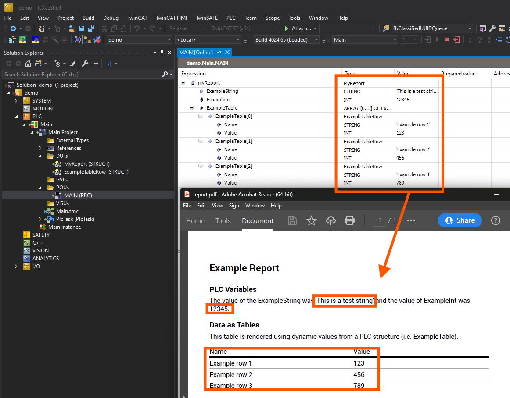

# Structure to PDF

## Disclaimer

This is a personal guide not a peer reviewed journal or a sponsored publication. We make
no representations as to accuracy, completeness, correctness, suitability, or validity of any
information and will not be liable for any errors, omissions, or delays in this information or any
losses injuries, or damages arising from its display or use. All information is provided on an as
is basis. It is the reader’s responsibility to verify their own facts.

The views and opinions expressed in this guide are those of the authors and do not
necessarily reflect the official policy or position of any other agency, organization, employer or
company. Assumptions made in the analysis are not reflective of the position of any entity
other than the author(s) and, since we are critically thinking human beings, these views are
always subject to change, revision, and rethinking at any time. Please do not hold us to them
in perpetuity.

## Overview

This is a simle example of fetching and processing data from a PLC structure variable, and subsequently transforming this data into a PDF document. The core functionality involves accessing a specific PLC variable via its name, attempting to apply the contents of this variable to a predefined template, and, upon successful integration, generating a PDF output. 

## Screenshot



## Getting Started

### Dependencies

This project uses:

* Node.js (v18.16.1 or later recommended)
* TwinCAT 4024.47

### Installation

Clone the repo

```bash
git clone https://github.com/benhar-dev/nodejs-structure-to-pdf.git
```

Install NPM packages
```bash
cd nodejs-structure-to-pdf
npm install
```
## Usage

### Prepare the TwinCAT program
Make sure the TwinCAT runtime is installed and running. There's a TwinCAT example project included in the twincat folder of this project for your reference.

### Prepare the Template
There's a copy of template.json in the template folder. Make sure to use it as the template for creating your PDF.

### Run the program
The program takes the following arguments:

1. pdfPath : The path to the output PDF file.|
2. templatePath: the path to the JSON template file.
3. variable: the name of the PLC structure variable to read.
4. netId (optional): the ADS Net ID of the PLC, defaults to 127.0.0.1.1.1.
5. port (optional): the ADS port, defaults to 851.

You can run the program via npm:

Using full names
```bash
node app.js --pdfPath "C:/temp/myPdf.pdf" --templatePath "C:/temp/template.json" --variable "Main.myVariable" --address "127.0.0.1.1.1" --port 851
```
Using alias

```bash
node app.js -p "C:/temp/myPdf.pdf" -t "C:/temp/template.json" -v "Main.myVariable" -a "127.0.0.1.1.1" -r 851
```

Getting help
```bash
node app.js --help
Options:
      --version       Show version number                              [boolean]
  -p, --pdfPath       The path to the PDF file.              [string] [required]
  -t, --templatePath  The path to the template file.         [string] [required]
  -v, --variable      The variable.                          [string] [required]
  -a, --address       The address.           [string] [default: "127.0.0.1.1.1"]
  -r, --port          The port.                          [number] [default: 851]
      --help          Show help                                        [boolean]
```
## License
This project is licensed under the terms of the MIT license.